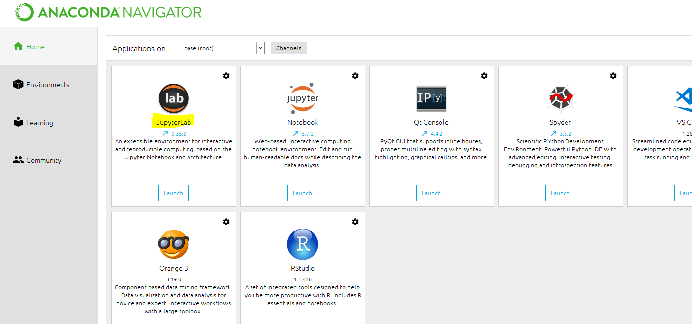

# 开始机器学习之前：配置开发环境

## 开发环境：Jupyter lab

课程中的开发环境是Jupyter lab，Jupyter lab是Jupyter Notebook的升级版，页面更加美观操作更加简便，和
Notebook一样是anaconda自带，在cmd或者anaconda prompt里面输入Jupyter lab即可打开，或者也可以在
Anaconda页面中找到它的接口。Jupyter lab中大部分操作都和Notebook一样，每个人电脑的设置不同，可能存在
Jupyter lab无法使用的情况，那使用Jupyter Notebook也是没有问题的。



## 所需库和版本（基于anaconda）

课程中需要使用到的库/模块，以及我所使用的版本供大家参考：

Anaconda：4.6.8（你的版本最少要4.6.7或以上

Python 3.7.2 （你的版本至少要3.6或以上

Scikit-learn 0.20.3 （你的版本至少要0.20或以上

Graphviz 0.8.

NumPy 1.16.

Pandas 0.24.2（你的版本至少要0.23或以上

Matplotlib 3.0.

SciPy 1.2.

以上的库和模块都是必须的，版本可以不用太过限制不过尽量保持和需求的一致会比较理想。这些库大部分是
anaconda自带的，但是graphviz需要自行安装，详情请参考“安装graphviz”章节。你可以使用以下代码来查看你现
在所安装的版本和库是否达到要求，如果没有达到要求，请参考下面的部分来进行更新/安装：
```python
#导入所需要的库
import pandas as pd
import numpy as np
import sklearn
import matplotlib as mlp
import scipy
```
如果出现"no module named xxxx"这样的错误，证明你的计算机缺乏xxxx库，则需要另行安装。另行安装的时候，请在cmd或者anaconda prompt里面运行以下代码。**缺哪个库，安哪个库，切勿覆盖/重新安装已存在的库**。注意，安装时一次一行，一次一库。
```python
#在cmd或anaconda prompt中逐行运行

conda install numpy
conda install pandas
conda install scipy
conda install matplotlib
conda install scikit-learn
```
如果导入没有报错，你可以继续运行下面的代码来查看你的anaconda版本：
```python
%%cmd
conda -V
```
并运行以下代码来查看你的Python版本：
```python
%%cmd
python -V
```
你可使用以下代码来查看你其他库的版本：
```python
module = [pd,np,sklearn,mlp,scipy]
name = ["pandas","numpy","sklearn","matplotlib","scipy"]

for name,item in zip(name,module):
	print("{}:{}".format(name,item.__version__))
```
```

```
```
#在cmd或anaconda prompt中逐行运行
```
```
#更新anaconda(可能耗时较长时间)
conda update -n base -c defaults conda
```
```
#更新Python
conda update python
```
```
#更新所需要的库
conda update pandas
conda update numpy
conda update scipy
conda update matplotlib
conda update scikit-learn
```
```
#一次性更新anaconda下面所有的库(可能耗时较长时间)
conda update --all
```
在许多时候，我们也通过pip进行操作，但如果能够使用Anaconda，就不推荐使用pip。pip安装一部分库的时候可能
会出现异常，原因是pip默认下载的一部分库的版本（如SciPy）可能只适用于linux系统，而Anaconda的安装一般不
会有这个问题。对于能够自己排查出现的问题的学员，请随意选择任何安装方式。
但注意，Anaconda的安装和pip的安装尽量不要混用，由Anaconda安装的库在使用pip卸载或是更新的时候，可能
出现无法卸载干净，无法正常更新，或更新后一部分库变得无法运行的情况。安装过程中任何的报错，都可以通过卸
载重装来解决问题，这是最有效率的方式。

## 安装和配置graphviz

graphviz是我们算法模块中比较重要的一个库，我们会使用它来对我们的重要算法：决策树进行绘图。通常来说
graphviz都不太可能是自带的。Mac系统下安装graphviz相对简单，可以参考博文：https://blog.csdn.net/qq_
7641/article/details/78224910。Windows系统可以参考下面的步骤来进行安装：

1. **下载安装包**

首先进入官网https://graphviz.gitlab.io/_pages/Download/Download_windows.html下载msi文件。


2. **下载完毕后双击msi文件，开始进行安装：**

   

点击next，进入页面，自选安装地址，并记下这个地址：


一路next直到安装完毕。

3. 设置环境变量

安装完毕之后，我们需要手动配置环境变量。找到刚才我们记下的安装地址，进入graphviz-2.38文件夹：


找到bin文件夹，并复制下bin文件夹所在的路径：


回到桌面，找到“计算机”，点击右键找到“属性”；点击属性，找到“高级系统设置”，单击进入系统属性：


在系统属性中-高级-环境变量，单击环境变量：


这里我们可以看到系统变量与用户变量，其中系统变量下有个“Path”路径：


选中“path”，点击编辑，在编辑变量中点击新建，将安装的Graphviz的bin目录路径添加入变量中，点击确定，
GraphViz的环境变量就配置完成了。


配置完成后，进入cmd运行如下命令：

```
dot -version
```

如果显示出相应的graphviz信息，则配置就是完成了：


安装完毕后，可以通过以下代码在Jupyter中查看graphviz的版本：

安装好所有的库之后，你的机器学习旅程就可以开始啦~祝学习愉快！

```
import graphviz
```
```
graphviz.__version__
```

